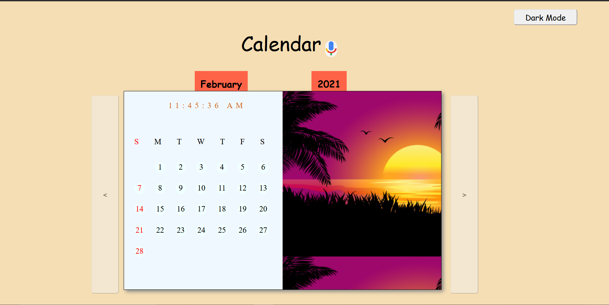
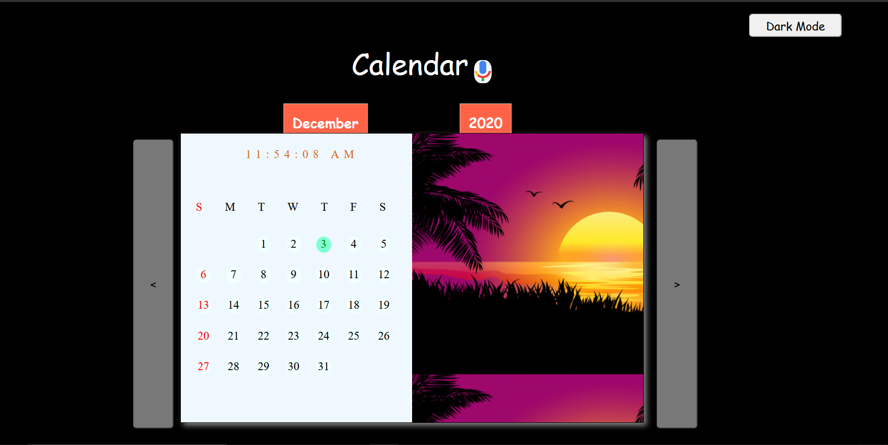

# Web Calendar

## Dark Mode Off:

## Dark Mode On:

The Web Calendar Project aims to bring the functionalities of a Physical Calendar onto web with some easy to click buttons and other functionalities not present physically.
The tecnologies used are HTML,CSS And JavaScript.

The project is live at: https://jorawarsinghsaini.github.io/simple_calendar/
Open this project in Google Chrome to enable voice commands.

Steps for voice commands.
1. Open in Google Chrome.
2. Click on Google Voice Button next to Calendar Header.
3. Allow Permission for audio.
4. Say something like "Add meeting on 12"
5. Done.
The version currently takes only dates of the current month and add events to it.
The events are highligted in calendar with dark orange color.

The functinalities included in this project version are:

* The dates are placed accurately according to the given month and year.
*  The calendar's html and css are wriiten to adjust different dates possible in month and stop their overflow.
* The month and year are shown just above the calendar with tomato background and cursive font family.
* Current Date is highlighted in calendar with aqua color.
* The next and previous month button lets us scroll through the months.
* The dates are clickable.
* The clickable functionality can be used to add events on that particular date.
* Sundays are highligted with red color to indicate holidays.
* Dark Mode Button is available.
* Dark Mode can be activated in which the background is toggled to black and font to white to reduce strain at night.
* Leap Year is taken into account and February days are shown accordingly.
* Central Theme of yellow color is tried to be maintained throughout.
* A Google voice button.
* Direct Voice commands can be sent to add events on particular dates. Web Speech Recognition Toolkit is used for this purpose.

Goals for next version:
* Complete Responsiveness for some of the components of website is due.
* Direct scrolling to a particular year is due.
* Public Holidays and Festivals to be highlighted.
* Voice command for any month and year too.
